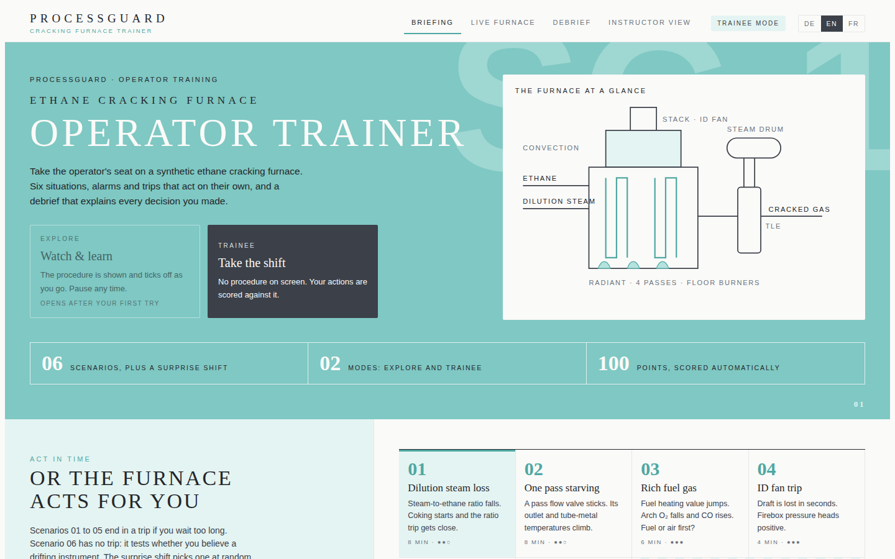
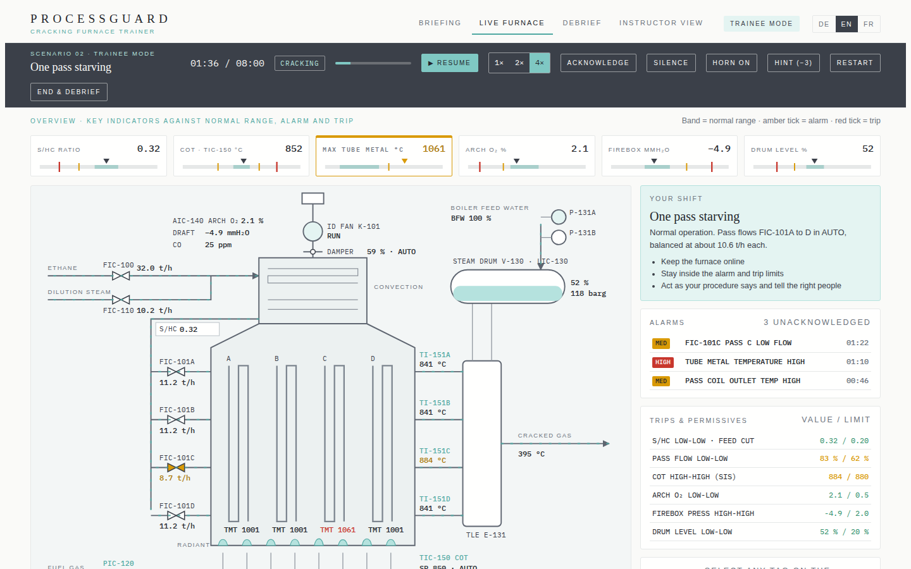
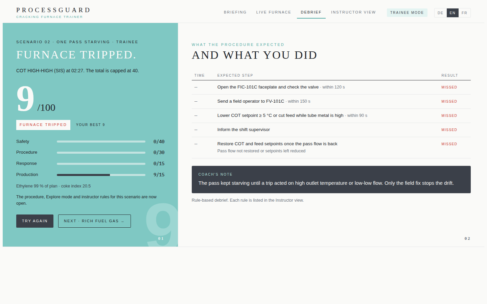

# Cracking Furnace Trainer

A browser-based operator training prototype for an **ethane cracking furnace**. A trainee takes the shift, an upset starts, alarms and trips act on their own, and every action is scored automatically against the procedure. The debrief explains what was expected and what the trainee did.

The idea comes from operator training simulator (OTS) practice, where an instructor injects a malfunction and the system scores the operator's response. This prototype shows the same method in one HTML file that runs in any browser, in **English, German and French**.

> **Engineering prototype.** The radiant coil uses published ethane cracking kinetics; the firebox, steam drum and controls are simplified. Values and trip limits are illustrative. Not a certified training system and not based on any specific plant. No plant, client or employer data is used.



## Try it

Open `index.html` in a browser, or use the GitHub Pages link of this repository. No install, no server.

1. Choose **Trainee** (procedure hidden, scored) or **Explore** (procedure shown; opens after your first try of a scenario). Pick **DE · EN · FR** at the top right.
2. Pick a scenario, or the **Surprise shift** (random scenario, random start, name hidden until the debrief).
3. Open the live furnace, press **Start**, and operate through the faceplates: setpoints, controller modes, pumps, the ID fan, and radio calls to field, utilities, supervisor, maintenance and instrumentation.
4. Read the debrief: score in four parts, each expected step next to your action, harmful actions, a coaching note and your personal best.



## What the live screen shows

- **Overview bar** in the style of ISA-101 high-performance HMI: six key values against their normal band, alarm and trip marks.
- **Process graphic** with animated flows (speed follows the actual flow), burner flames that follow firing, the ID fan turning and the drum level moving. Animations use [GSAP](https://gsap.com) 3.12.5 from cdnjs; the page works without it.
- **Alarm list with horn** for high-priority alarms, with silence and acknowledge, trips and permissives, faceplates, a trend and radio calls.

## Scenarios

| # | Scenario | What the trainee must recognise | If nothing is done |
|---|---|---|---|
| 01 | Dilution steam loss | Steam/ethane ratio falls; cut feed to protect the ratio | S/HC low-low trip |
| 02 | One pass starving | A pass valve sticks; that pass runs hot; send the field operator to the right valve | COT high-high or pass flow low-low trip |
| 03 | Rich fuel gas | Fuel-rich firebox: cut fuel first, do not add air fast | Arch O₂ low-low trip |
| 04 | ID fan trip | Draft lost; open the stack damper, cut firing, restart the fan | O₂ / firebox pressure trip |
| 05 | Steam drum level low | Feed-water pump trips and the standby fails to auto-start | Drum level low-low trip |
| 06 | Is it real? | One outlet thermocouple drifts high with no BAD status; cross-check and take it out of control | No trip, but lost ethylene |

## Model

**Radiant coil (physics).** Each of the four passes is a plug-flow coil with uniform heat flux, solved in 40 sections every simulation step. It uses three molecular reactions of the Sundaram and Froment (1977) ethane scheme with their published frequency factors and activation energies:

| Reaction | A | E (cal/mol) |
|---|---|---|
| C₂H₆ ⇌ C₂H₄ + H₂ | 4.65 × 10¹³ s⁻¹ | 65 210 |
| 2 C₂H₆ → C₃H₈ + CH₄ | 3.85 × 10¹¹ L/mol/s | 65 250 |
| C₂H₄ + C₂H₆ → C₃H₆ + CH₄ | 7.08 × 10¹³ L/mol/s | 60 430 |

Heats of reaction, heat capacities and the C₂H₆ ⇌ C₂H₄ + H₂ equilibrium are constant or approximate values. The coil volume and design duty are calibrated once so the design point gives a COT of 850 °C at 65 % ethane conversion. That calibration gives about 53 wt % ethylene yield, inside the typical published range for ethane cracking. A pass with less flow gets the same heat and runs hotter, so scenario 02 follows from the physics rather than from a rule.

**Simplified parts.** Firebox heat release with a 30 s lag; flue gas O₂, CO and draft from combustion stoichiometry and a fan/damper draft balance; tube metal temperature from heat flux, mass velocity and coke layer; steam drum mass balance with shrink and swell; PI controllers for COT, O₂, steam ratio and drum level.

**Trips.** Process trips cut feed, reduce firing and keep dilution steam on the coils. Combustion trips cut all fuel. The COT high-high trip acts after a 60 s delay and uses safety sensors separate from the control thermocouples. Real trip actions depend on each furnace design.

## Scoring

| Part | Points | Basis |
|---|---|---|
| Safety | 40 | Zero on a trip, otherwise reduced by time in high-priority alarm |
| Procedure | 30 | Steps done (full), late (half) or missed |
| Response | 15 | Time to the key action |
| Production | 15 | Ethylene made against plan (from the coil model), minus coke formed |

Hints cost 3 points, harmful actions 5, and a trip caps the total at 40. Every rule is listed in the Instructor view, which opens after the first try of each scenario. Reviewers can unlock everything from the Briefing page.



## Sources behind design choices

- Sundaram, K. M. and Froment, G. F. (1977). Modeling of thermal cracking kinetics I: thermal cracking of ethane, propane and their mixtures. *Chemical Engineering Science* 32, 601–608.
- Control Talk, *A practical understanding of furnace pressure control solutions* (controlglobal.com): on low O₂, reduce fuel rather than add air.
- Kenexis, on fuel-rich fireboxes and on sharing field devices between control and safety systems (IEC 61511).
- US patent US11028327B2, partial trip system for ethylene furnaces.
- NAMUR NE 43 sensor failure signalling, which is why scenario 06 uses drift and not burnout.
- Control Engineering, *High-performance HMIs: designs to improve operator effectiveness* (ISA-101 principles).

## Repository layout

```
index.html                 built single-file app (open this)
src/engine.js              coil kinetics, furnace model, alarms, trips, scenarios, scoring
src/ui.html                page and interface; engine and translations are inlined at build time
src/i18n.tsv               English → German → French text table (tab separated)
tools/build.py             builds index.html from src/
tests/engine-test.js       runs every scenario with no action and with a good operator
docs/                      screenshots and the operator feedback guide
.github/ISSUE_TEMPLATE/    feedback form for operators and OTS engineers
```

Build and test:

```
python3 tools/build.py
node tests/engine-test.js
```

## Limitations

- Lumped coil per pass, uniform heat flux and approximate thermodynamics; no acetylene, butadiene or heavier products.
- The firebox, drum and controller models are simplified; limits and timings are illustrative, and scenario 06's drift is time-compressed.
- Scoring is rule-based and transparent, not a validated competency assessment.
- German and French translations were written for this prototype and should be checked by native-speaking process engineers.
- Progress, personal bests and language choice are stored only in the viewer's own browser.

## Feedback

Operators, shift leaders and OTS engineers: please open an issue with the **Operator feedback** template, or see [docs/operator-feedback.md](docs/operator-feedback.md).

## Author

Madhushree Bharadwaj, process simulation and OTS engineer.
